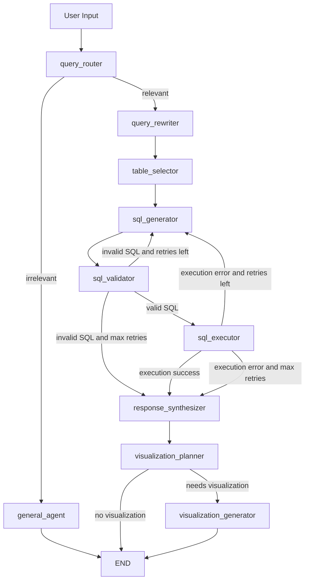

# University QA Agent

LangGraph-based question-answering application over a seeded SQLite university database.

The app accepts natural-language questions, routes them through a LangGraph workflow, generates read-only SQL, executes it against SQLite, and returns a human-readable answer. It also supports optional Vega-Lite visualizations and LangSmith tracing.

## Start

Create a local `.env` file:

```bash
cp .env-example .env
```

Set at least:

```env
OPENAI_API_KEY="your_openai_key"
```

Full `.env` example:

```env
OPENAI_API_KEY="your_openai_key"

DATABASE_URL="db/university.db"
SCHEMA_PATH="db/schema.sql"
SEED_PATH="db/seed.sql"

LLM_MODEL="gpt-4o"
LLM_MAX_RETRIES=2
SQL_MAX_RETRIES=3

LANGSMITH_TRACING=true
LANGSMITH_API_KEY="your_langsmith_key_or_empty"
LANGSMITH_PROJECT="genpact-hw-task"
LANGSMITH_RUN_NAME="University QA LangGraph"
LANGSMITH_TAGS="streamlit,langgraph,university-qa"
```

For local development without LangSmith, set:

```env
LANGSMITH_TRACING=false
LANGSMITH_API_KEY=""
```

Run with Docker:

```bash
docker compose up --build
```

Open the app:

```text
http://localhost:8501
```

The container creates and seeds the SQLite database from:

```text
db/schema.sql
db/seed.sql
```

The generated SQLite file is stored in the Docker volume `university_data`.

To rebuild the database from scratch:

```bash
docker compose down -v
docker compose up --build
```

## Local Development

Install dependencies:

```bash
pip install -r requirements.txt
```

Create and seed the local database:

```bash
python scripts/seed_database.py --reset
```

Run Streamlit:

```bash
streamlit run frontend/streamlit_app.py
```

## Tests

Run tests locally:

```bash
python -m pytest -q
```

Run tests in Docker:

```bash
docker compose run --rm tests
```

The tests use a temporary SQLite database and mocked LLM calls, so they do not require an OpenAI API key.

Current coverage includes:

- database joins and aggregations
- SQL safety validation
- SQL compilation validation against the active SQLite schema
- SQL generation node behavior with mocked LLM output
- end-to-end LangGraph flow with mocked LLM calls

## Architecture

```text
frontend/
  streamlit_app.py        Streamlit UI, local trace rendering, user input/output

backend/
  config.py               Environment-based settings
  graph/graph.py          LangGraph workflow definition
  agents/                 Individual LangGraph nodes
  services/llm.py         OpenAI client setup and optional LangSmith wrapping
  tools/sql.py            SQLite connection, seeding, query execution
  tools/schema.py         Schema extraction and FK relationship expansion
  tools/validator.py      Read-only SQL and schema compilation validation
  tools/prompts.py        Shared system prompt templates
  state/state.py          Shared LangGraph state type

db/
  schema.sql              Relational schema
  seed.sql                Demo data

scripts/
  seed_database.py        Rebuilds the local SQLite database
```

## Database

The demo database models a university domain with:

- students
- student groups
- teachers
- courses
- course offerings by semester/year
- enrollments
- grades

The committed repository includes only `db/schema.sql` and `db/seed.sql`. The generated SQLite file `db/university.db` is ignored and can be recreated at any time.

## DB-Agnostic Design

The core agent logic is designed to avoid hardcoded schema assumptions. The prompts and Python code do not need to be rewritten when the database changes.

The app discovers schema information from the connected SQLite database and passes that schema into the SQL generator. Table selection uses the current table names, and selected tables are expanded through foreign-key relationships so bridge tables can be included automatically.

To use another SQLite database, add the database file and point the app to it:

```env
DATABASE_URL="path/to/your.db"
```

If you also want the app to create and seed that database automatically, provide matching schema and seed files:

```env
SCHEMA_PATH="path/to/schema.sql"
SEED_PATH="path/to/seed.sql"
```

That is the expected adaptation path: replace or add DB files and update environment variables. The LangGraph nodes, validators, prompt templates, and Streamlit app should stay the same.

The backend validation logic stays generic:

- only read-only `SELECT` / `WITH` queries are allowed
- multiple SQL statements are rejected
- generated SQL must compile against the active database schema

## LangGraph Agent Flow



### Agent Responsibilities

| Node | Responsibility |
| --- | --- |
| `query_router` | Decides whether the question is relevant to the connected database. |
| `general_agent` | Handles greetings, chitchat, and out-of-scope questions. |
| `query_rewriter` | Rewrites the user query into a clearer SQL-friendly question. |
| `table_selector` | Selects relevant tables and expands bridge tables through foreign keys. |
| `sql_generator` | Generates read-only SQL using the selected schema context. |
| `sql_validator` | Checks SQL safety and verifies SQLite can compile the query. |
| `sql_executor` | Executes the validated query against SQLite. |
| `response_synthesizer` | Converts database rows into a concise answer. |
| `visualization_planner` | Decides whether a chart is useful. |
| `visualization_generator` | Produces Vega-Lite JSON for Streamlit rendering. |

## Tracing And Observability

The Streamlit app shows a local trace for every run:

```text
User Input -> LangGraph Nodes -> SQL -> DB Results -> Final Answer
```

LangSmith tracing is also supported. Add these values to `.env`:

```env
LANGSMITH_TRACING=true
LANGSMITH_API_KEY="your_langsmith_key"
LANGSMITH_PROJECT="genpact-hw-task"
```

Then run the app and ask a question. The trace will appear in LangSmith under the configured project.

The OpenAI client is wrapped with LangSmith when tracing is enabled, so LLM calls are visible inside the trace.

## Example Questions And Expected Answers

### Basic Lookups

```text
How many students are in the database?
```

Expected answer:

```text
20
```

```text
Which students are in group CS-101?
```

Expected answer:

```text
Noa Cohen
Eitan Levi
Maya Rosen
Michael Carter
```

```text
Which courses does Rachel Cohen teach?
```

Expected answer:

```text
Introduction to Programming
Database Systems
```

### Joins And Filters

```text
Which teacher teaches Machine Learning in Spring 2026?
```

Expected answer:

```text
Yael Levi
```

```text
Show courses offered in Spring 2026.
```

Expected answer:

```text
Business Intelligence
Cloud Computing
Database Systems
Machine Learning
Product Management
UX Research
Web Development
```

```text
List students who failed any course.
```

Expected answer:

```text
Ariel Abramson
Lior Barak
Michael Carter
Hannah Davis
Omer Haddad
Rachel Johnson
Itamar Shalev
Jonathan Smith
```

### Aggregations

```text
What is the average grade in Database Systems?
```

Expected answer:

```text
80.0
```

```text
Which course has the highest average grade?
```

Expected answer:

```text
Machine Learning, average grade 88.13
```

```text
What is the average grade by student group?
```

Expected answer:

```text
CS-101: 86.88
DS-201: 84.86
SE-102: 82.0
CY-301: 77.69
BA-401: 75.21
```

### Visualization

```text
Show a bar chart of average grade by course.
```

Expected behavior:

```text
The app should return rows grouped by course and render a Vega-Lite bar chart.
```

```text
Plot number of enrollments per course.
```

Expected behavior:

```text
The app should return enrollment counts by course and render a chart.
```

### Out-of-Scope Routing

```text
What is the weather in Tel Aviv today?
```

Expected behavior:

```text
The query should route to general_agent, not SQL generation.
```

## Production Considerations

To move this project toward production, the main areas to improve are:

- use managed database credentials instead of local SQLite files
- add authentication and authorization for users
- restrict generated SQL further with query timeouts and row limits
- store traces and logs centrally
- monitor failures, latency, token usage, and database errors
- add CI for tests and linting
- deploy Streamlit or replace it with a production web API plus frontend
- add rate limits and guardrails for expensive queries
- isolate schema-specific business definitions outside core agent code

## Useful Environment Variables

```env
OPENAI_API_KEY="..."

DATABASE_URL="db/university.db"
SCHEMA_PATH="db/schema.sql"
SEED_PATH="db/seed.sql"

LLM_MODEL="gpt-4o"
LLM_MAX_RETRIES=2
SQL_MAX_RETRIES=3

LANGSMITH_TRACING=false
LANGSMITH_API_KEY=""
LANGSMITH_PROJECT="genpact-hw-task"
LANGSMITH_RUN_NAME="University QA LangGraph"
LANGSMITH_TAGS="streamlit,langgraph,university-qa"
```
